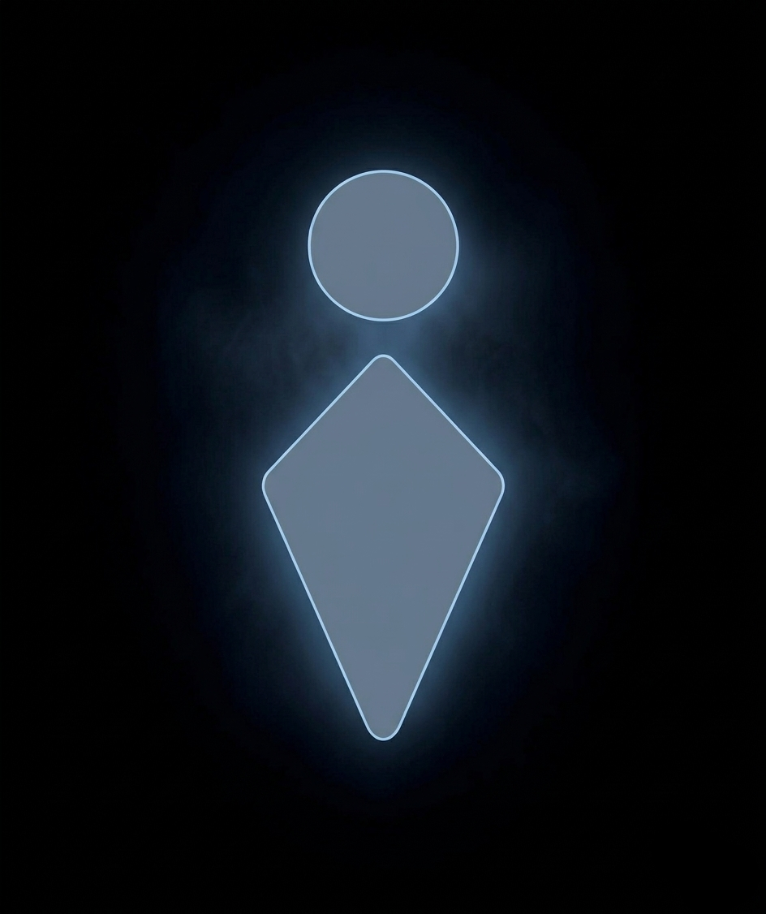

# leviar Engine
## High-Performance 2.5D Rendering Engine for WebGL


<p align="center">
  
</p>

**leviar**는 WebGL의 강력한 성능을 기반으로, 복잡한 3D 수식 없이도 **2.5D 시각 효과**와 **현실적인 물리 엔진**을 구현할 수 있는 모던 렌더링 엔진입니다.

---

## 🎮 실시간 예제 보기 (Live Demo)

leviar 엔진이 제공하는 다양하고 화려한 시각적 기능들을 바탕으로 한 예제들을 웹 브라우저에서 즉시 체험해 보세요!

👉 **[leviar 엔진 통합 예제 페이지 접속하기 🚀](https://izure1.github.io/leviar/)**

---

## ✨ 왜 leviar인가요?

| 🚀 성능 (Performance) | ⚖️ 물리 (Physics) | 🎬 연출 (Dynamics) |
| :--- | :--- | :--- |
| **WebGL 기반 최적화**: 수천 개의 객체를 부드럽게 렌더링하는 인스턴싱 기술 적용. | **Z-Isolation**: *matter-js*을 기반으로 심도에 따른 지능적 충돌 레이어 분리 시스템 제공. | **34종 이징(Easing)**: 어떤 속성이든 살아 움직이게 만드는 애니메이션 엔진. |

---

## 🏗️ 핵심 아키텍처

레비아 엔진은 객체를 6가지 명확한 레이어로 구분하여 정밀하게 제어합니다.

### 속성

레비아 엔진은 직관적이고 효율적인 제어하기 위해 메서드에 의존하지 않고
객체의 **속성(Attribute/Style/Transform)을 직접 수정하는 방식**을 지향합니다.

-  🏷️ **[Attribute](docs/attribute.md)**: 객체의 ID, 물리 특성 및 타입을 정의하는 식별 계층.
-  🎨 **[Style](docs/style.md)**: CSS 기반의 친숙한 외형 디자인 (BorderRadius, Shadow 등).
-  📐 **[Transform](docs/transform.md)**: 3D 월드 상의 위치, 회전, 크기 및 부모-자식 계층 관리.
-  📦 **[Dataset](docs/dataset.md)**: 애니메이션과 연계되는 지능적 사용자 데이터 저장소.

### 메서드

메서드는 속성만으로 표현하기 어려운 복잡한 물리 연작용이나 애니메이션 트랜지션을 보존하기 위해 존재하는 강력한 유틸 함수입니다.

-  🛠️ **[Method](docs/method.md)**: `animate`, `follow`, `applyForce` 등 구체적 동작 명령.

### 이벤트

객체의 상태 변화나 상호작용을 감지하는 데 사용됩니다.

-  🔔 **[Event](docs/event.md)**: 상호작용 및 변화를 감지하는 실시간 이벤트 시스템.

---

## ⚡ 빠른 시작 (Quick Start)

### Node.js

```bash
npm install leviar
```

### Browser

```html
<script src="https://cdn.jsdelivr.net/npm/leviar@1/+esm"></script>
```

단 몇 줄의 코드로 입체감 있는 세계를 창조하세요.

```typescript
import { World } from 'leviar'

const world = new World()
const camera = world.createCamera({ attribute: { focalLength: 150 } })
world.camera = camera

// 화려한 상자 하나를 월드 중앙에 배치합니다.
const box = world.createRectangle({
  attribute: { name: 'hero_box', physics: 'dynamic' },
  style: { 
    color: '#3498db', width: 100, height: 100, 
    borderRadius: 15, boxShadowBlur: 20 
  }
})

// 속성을 직접 수정하여 회전시키며 투명하게 만드는 애니메이션!
box.animate({
  style: { opacity: 0.3 },
  transform: { rotation: { z: '+=360' } }
}, 1500, 'easeInOutBack')

world.start()
```

---

## 🎥 더 깊이 알아보기

-  📸 **[카메라와 원근감](docs/camera.md)**: 초점 거리와 깊이에 따른 시각적 깊이감 제어.
-  ⚖️ **[물리 엔진 활용](docs/physics.md)**: 현실적인 마찰, 반발, 중력 제어 가이드.
-  🏃 **[애니메이션 가이드](docs/animation.md)**: 수치 기반의 부드러운 전환 연출법.

---

## 📜 License
MIT License. © 2026 leviar Engine Team.
