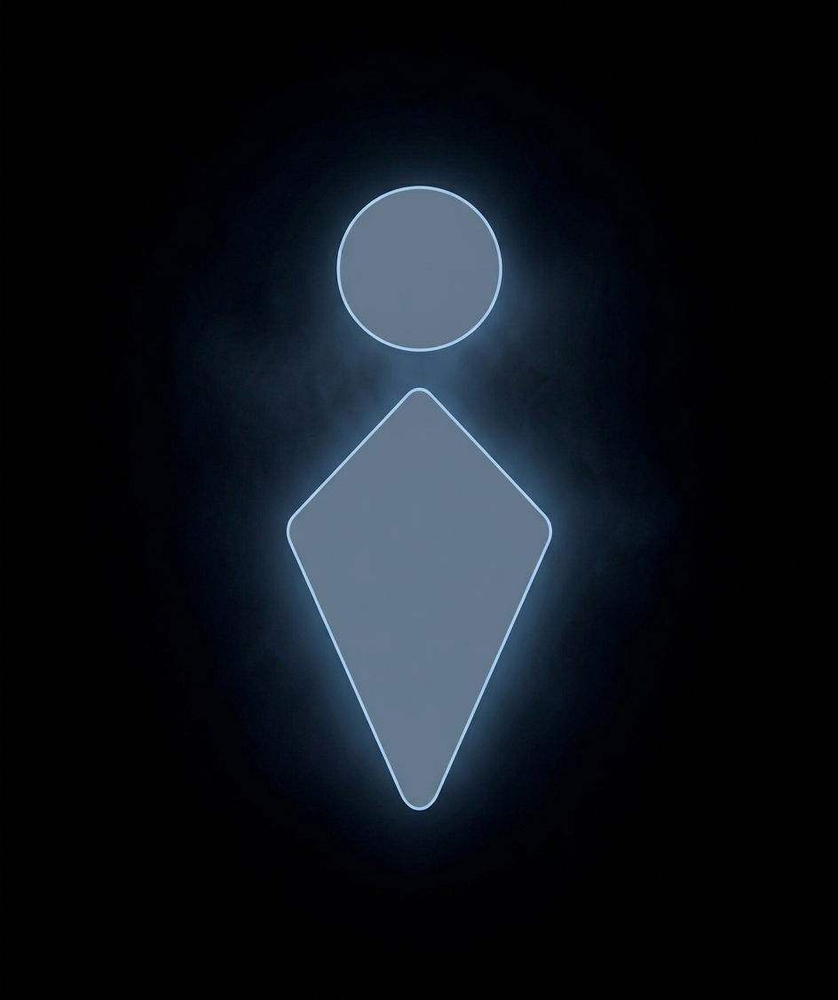

# leviar Engine
## High-Performance 2.5D Rendering Engine for WebGL


<p align="center">
  
</p>

**leviar** is a modern rendering engine that enables the implementation of **2.5D visual effects** and a **realistic physics engine** without complex 3D math, based on the powerful performance of WebGL.

---

## 🎮 Live Demo

Experience the examples based on the various and spectacular visual features provided by the leviar engine immediately in your web browser!

👉 **[Go to the leviar Engine Integrated Example Page 🚀](https://izure1.github.io/leviar/)**

---

## ✨ Why leviar?

| 🚀 Performance | ⚖️ Physics | 🎬 Dynamics |
| :--- | :--- | :--- |
| **WebGL-based Optimization**: Applies instancing technology to smoothly render thousands of objects. | **Z-Isolation**: Provides an intelligent collision layer separation system according to depth based on *matter-js*. | **34 Easing types**: An animation engine that makes any attribute come alive and move. |

---

## 🏗️ Core Architecture

The leviar engine manages objects precisely by dividing them into 6 distinct layers.

### Attributes

To ensure intuitive and efficient control, the leviar engine aims to **directly modify the attributes (Attribute/Style/Transform) of objects** rather than relying on methods.

-  🏷️ **[Attribute](docs/attribute.md)**: An identification layer that defines the object's ID, physical properties, and type.
-  🎨 **[Style](docs/style.md)**: Familiar visual design based on CSS (BorderRadius, Shadow, etc.).
-  📐 **[Transform](docs/transform.md)**: Manages position, rotation, scale, and parent-child hierarchy in the 3D world.
-  📦 **[Dataset](docs/dataset.md)**: An intelligent user data repository linked with animations.

### Methods

Methods are powerful utility functions that exist to preserve complex physical interactions or animation transitions that are difficult to express with attributes alone.

-  🛠️ **[Method](docs/method.md)**: Specific action commands like `animate`, `follow`, `applyForce`, etc.

### Events

Used to detect object state changes or interactions.

-  🔔 **[Event](docs/event.md)**: A real-time event system for detecting interactions and changes.

---

## ⚡ Quick Start

### Node.js

```bash
npm install leviar
```

### Browser

```html
<script src="https://cdn.jsdelivr.net/npm/leviar@1/+esm"></script>
```

Create a three-dimensional world with just a few lines of code.

```typescript
import { World } from 'leviar'

const world = new World()
const camera = world.createCamera({ attribute: { focalLength: 150 } })
world.camera = camera

// Place a colorful box in the center of the world.
const box = world.createRectangle({
  attribute: { name: 'hero_box', physics: 'dynamic' },
  style: { 
    color: '#3498db', width: 100, height: 100, 
    borderRadius: 15, boxShadowBlur: 20 
  }
})

// An animation that directly modifies attributes to rotate and become transparent!
box.animate({
  style: { opacity: 0.3 },
  transform: { rotation: { z: '+=360' } }
}, 1500, 'easeInOutBack')

world.start()
```

---

## 🎥 Learn More

-  📸 **[Camera and Perspective](docs/camera.md)**: Controlling visual depth based on focal length and Z-depth.
-  ⚖️ **[Utilizing the Physics Engine](docs/physics.md)**: A guide to controlling realistic friction, restitution, and gravity.
-  🏃 **[Animation Guide](docs/animation.md)**: Value-based smooth transition direction techniques.

---

## 📜 License
MIT License. © 2026 leviar Engine Team.
